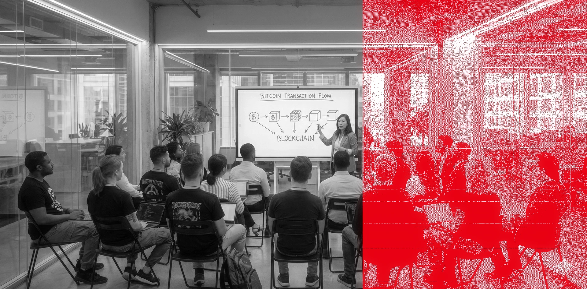
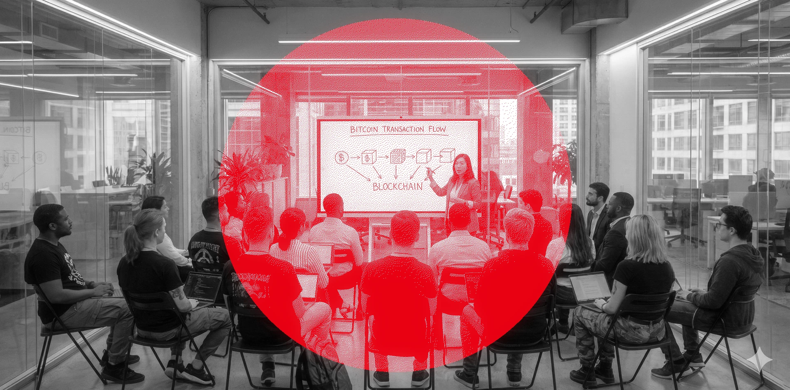
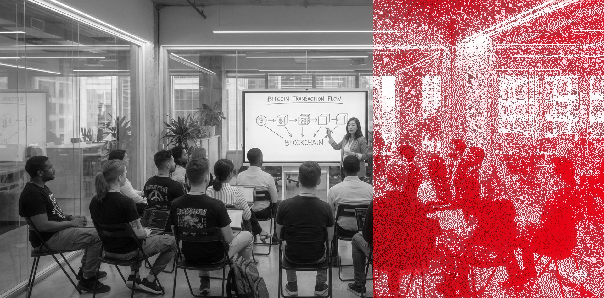
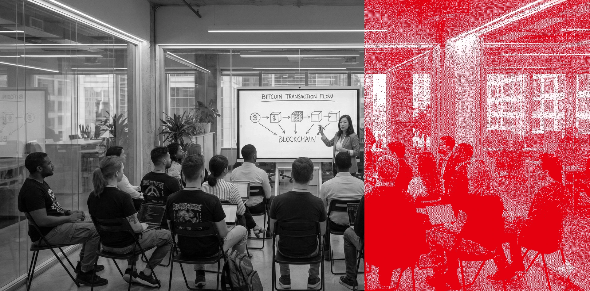
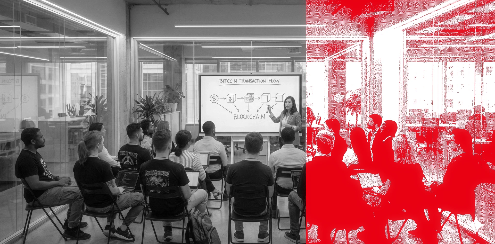
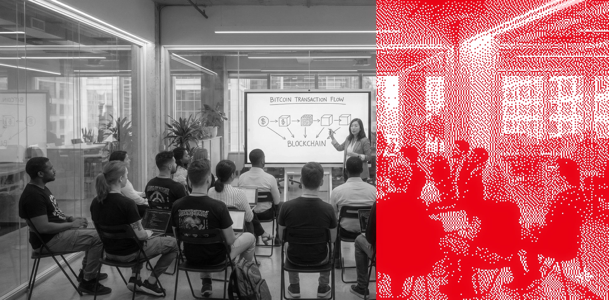
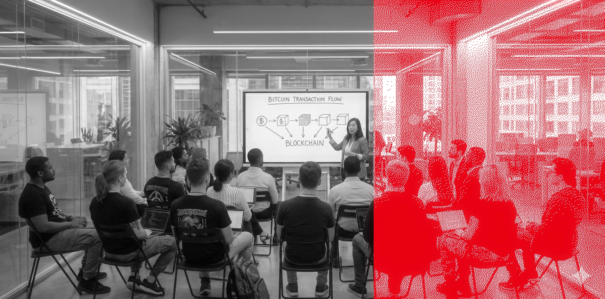

# Original Mode (`--mode=original`)

The **Original Mode** is a 3-color Floyd-Steinberg dithering effect designed by the Bitcoin Austria agency (nbb). Instead of the default binary dithering (ink vs. background), it uses a **3-color palette** of Austrian red, pink, and white to create a richer, more textured look.

## How It Works

The original effect was delivered as a JavaScript-based image processor. Here is how the core algorithm works:

### 1. Palette Definition

The effect uses exactly three colors:

```javascript
const ditherPalette = [
  { hex: '#E3000F', label: 'dark' },   // Austrian red
  { hex: '#ffc2c6', label: 'mid' },    // Pink (mid-tone)
  { hex: '#ffffff', label: 'light' },   // White
];
```

### 2. Closest Color Matching

For each pixel, the algorithm finds the nearest palette color using Euclidean distance in RGB space:

```javascript
function findClosestColor(r, g, b, palette) {
  let minDist = Infinity;
  let closest = palette[0];
  for (const c of palette) {
    const dr = r - c[0], dg = g - c[1], db = b - c[2];
    const dist = dr * dr + dg * dg + db * db;
    if (dist < minDist) {
      minDist = dist;
      closest = c;
    }
  }
  return closest;
}
```

This is the key difference from the default mode: instead of a binary threshold (black or white), each pixel gets mapped to whichever of the three colors is closest. Dark areas become red, mid-tones become pink, and light areas stay white.

### 3. Floyd-Steinberg Error Diffusion

The quantization error (difference between original color and chosen palette color) is distributed to neighboring pixels, creating smooth gradients:

```javascript
function ditherFloydSteinberg(pixels, width, height, palette) {
  for (let y = 0; y < height; y++) {
    for (let x = 0; x < width; x++) {
      const idx = (y * width + x) * 4;
      const oldR = pixels[idx], oldG = pixels[idx + 1], oldB = pixels[idx + 2];
      const [newR, newG, newB] = findClosestColor(oldR, oldG, oldB, palette);
      pixels[idx] = newR; pixels[idx + 1] = newG; pixels[idx + 2] = newB;
      const errR = oldR - newR, errG = oldG - newG, errB = oldB - newB;

      const distribute = (ox, oy, f) => {
        const nx = x + ox, ny = y + oy;
        if (nx >= 0 && nx < width && ny < height) {
          const ni = (ny * width + nx) * 4;
          pixels[ni]     += errR * f;
          pixels[ni + 1] += errG * f;
          pixels[ni + 2] += errB * f;
        }
      };
      distribute(1, 0, 7/16);    // right
      distribute(-1, 1, 3/16);   // bottom-left
      distribute(0, 1, 5/16);    // bottom
      distribute(1, 1, 1/16);    // bottom-right
    }
  }
}
```

The error weights (7/16, 3/16, 5/16, 1/16) are the classic Floyd-Steinberg coefficients, but applied **per RGB channel** (not just grayscale).

### 4. Brightness & Contrast Adjustments

Before dithering, the image is adjusted:

```javascript
function applyImageAdjustments(imageData) {
  const d = imageData.data;
  const brightness = state.brightness / 100;
  const contrast = state.contrast / 500;
  const factor = (259 * (contrast * 255 + 255)) / (255 * (259 - contrast * 255));

  for (let i = 0; i < d.length; i += 4) {
    // Brightness: multiply
    d[i]     = d[i] * brightness;
    d[i + 1] = d[i + 1] * brightness;
    d[i + 2] = d[i + 2] * brightness;
    // Contrast: pivot around 128
    d[i]     = factor * (d[i] - 128) + 128;
    d[i + 1] = factor * (d[i + 1] - 128) + 128;
    d[i + 2] = factor * (d[i + 2] - 128) + 128;
    // Clamp
    d[i]     = Math.max(0, Math.min(255, d[i]));
    d[i + 1] = Math.max(0, Math.min(255, d[i + 1]));
    d[i + 2] = Math.max(0, Math.min(255, d[i + 2]));
  }
}
```

### 5. Point Size (Pixel Chunking)

The image is downscaled by `point_size` before dithering, then upscaled with nearest-neighbor interpolation for a pixelated look:

```javascript
function renderDither() {
  const ps = state.pointSize;
  const w = Math.ceil(sourceImage.width / ps);
  const h = Math.ceil(sourceImage.height / ps);
  // ... draw source at (w, h) ...
  // ... dither at reduced resolution ...
  // Upscale with nearest-neighbor
  const outW = w * ps;
  const outH = h * ps;
  ctx.imageSmoothingEnabled = false;
  ctx.drawImage(workCanvas, 0, 0, outW, outH);
}
```

### 6. Detail Reduction

When `detail < 1.0`, the image is first downscaled to an even smaller size, then upscaled back to work resolution. This creates a blur effect that reduces fine detail before dithering:

```javascript
if (state.detail < 100) {
  const detailFactor = state.detail / 100;
  const dw = Math.max(1, Math.round(w * detailFactor));
  const dh = Math.max(1, Math.round(h * detailFactor));
  // Draw source small, then stretch to work size
  detailCtx.drawImage(sourceImage, 0, 0, dw, dh);
  workCtx.drawImage(detailCanvas, 0, 0, w, h);
}
```

### 7. Bloom Post-Processing

After dithering, an optional bloom effect adds a soft glow using screen blending:

```javascript
function applyBloom() {
  tempCtx.filter = `blur(${state.bloomRadius / 5}px)`;
  tempCtx.drawImage(mainCanvas, 0, 0);
  ctx.globalAlpha = state.bloomIntensity / 200;
  ctx.globalCompositeOperation = 'screen';
  ctx.drawImage(tempCanvas, 0, 0);
}
```

## Comparison: Default Mode vs Original Mode

| Feature | Default Mode | Original Mode |
|---|---|---|
| **Colors** | 2 (brand color + background) | 3 (red `#E3000F` + pink `#ffc2c6` + white) |
| **Dithering input** | Grayscale (single channel) | RGB (3 channels) |
| **Error diffusion** | Per-pixel grayscale | Per-channel RGB |
| **Output** | Binary bitmap, then colorized | Directly RGB from palette |
| **Mid-tones** | Density of dots (sparse = lighter) | Distinct pink color |
| **Point size** | N/A (uses `--reference-width` scaling) | `--point-size` (1-8) |
| **Brightness/Contrast** | N/A | `--brightness` / `--contrast` |
| **Detail** | N/A | `--detail` (blur pre-pass) |
| **Bloom** | N/A | `--bloom-intensity` / `--bloom-radius` |
| **Patterns** | floyd-steinberg, ordered, atkinson, etc. | Floyd-Steinberg only (3-color) |
| **Brand colors** | Configurable (`--brand`) | Fixed palette (red/pink/white) |
| **Shade/Satoshi** | Supported | N/A (ignored) |
| **Masks** | `--rect`, `--circle` | `--rect`, `--circle` (same) |
| **Glitch** | Row swap + channel shift | Row swap (same) |
| **Fade/Gradient** | Density mask | Density mask (same) |

## CLI Options

When using `--mode=original`, the following options are available:

| Option | Range | Default | Description |
|---|---|---|---|
| `--mode=original` | - | `default` | Activate original 3-color mode |
| `--point-size` | 1-8 | 1 | Pixel block size. 1 = per-pixel (fine), 4+ = chunky retro look |
| `--brightness` | 0.0-2.0 | 1.0 | Brightness multiplier. >1 = brighter |
| `--contrast` | 0.0-2.0 | 1.0 | Contrast adjustment. >1 = more contrast |
| `--detail` | 0.6-1.0 | 1.0 | Detail level. <1 = blur/soften before dithering |
| `--bloom-intensity` | 0.0-1.0 | 0.5 | Bloom glow strength. 0 = off |
| `--bloom-radius` | 1.0-150.0 | 75.0 | Bloom blur radius |

These options are **ignored in default mode**. The following default-mode options are **ignored in original mode**: `--pattern`, `--brand`, `--threshold`, `--darkness`, `--shade`, `--satoshi-mode`, `--background`.

Options that work in **both modes**: `--grayscale`, `--rect`, `--circle`, `--fade`, `--gradient`, `--glitch`, `--seed`, `--output`.

## Examples

All examples below are generated reproducibly by `generate-examples.sh` with `--seed=42`.

### Example 12: Original Mode

```bash
./effect.sh --mode=original --grayscale image.jpg
```


### Example 13: Original Mode with Glitch

```bash
./effect.sh --mode=original --grayscale --glitch=0.1 image.jpg
```



### Example 14: Circle Mask

```bash
./effect.sh --mode=original --grayscale --circle=0.5,0.5,0.3 image.jpg
```



### Example 15: Fade (Sparse Dithering)

```bash
./effect.sh --mode=original --grayscale --fade=0.5 image.jpg
```


### Example 16: Gradient Density

```bash
./effect.sh --mode=original --grayscale --gradient=0,0.1,1.0 image.jpg
```



### Example 17: No Bloom (Cleaner Look)

```bash
./effect.sh --mode=original --grayscale --bloom-intensity=0 image.jpg
```



### Example 18: Brightness & Contrast

```bash
./effect.sh --mode=original --grayscale --brightness=1.3 --contrast=1.2 image.jpg
```



### Example 19: Point-Size 4 (Chunky Pixels)

```bash
./effect.sh --mode=original --grayscale --point-size=4 image.jpg
```



### Example 20: Point-Size 2 with Detail Reduction

```bash
./effect.sh --mode=original --grayscale --detail=0.7 --point-size=2 image.jpg
```


