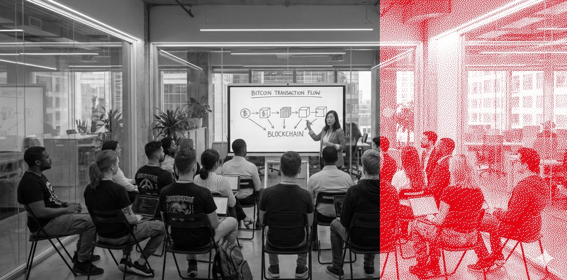
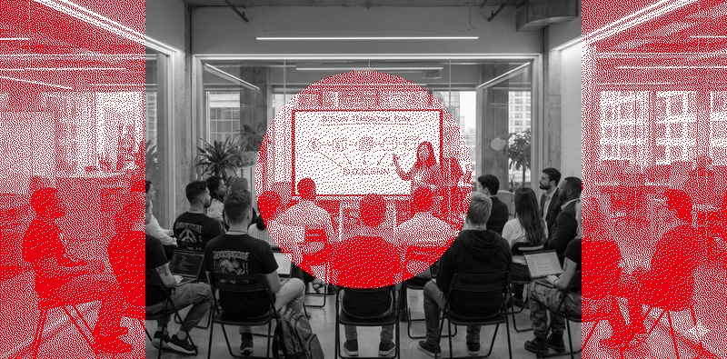
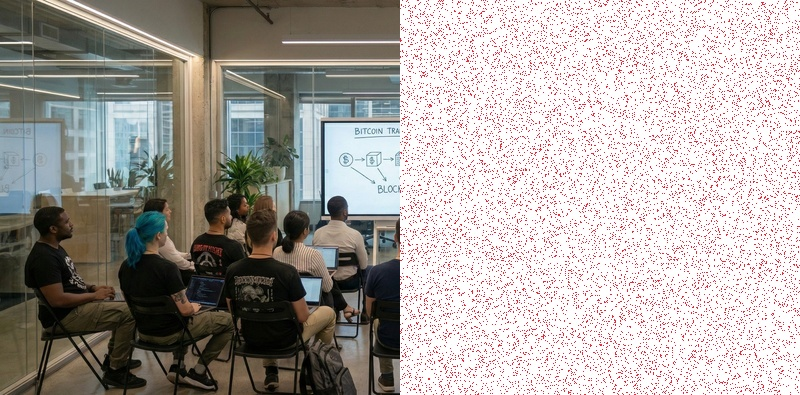
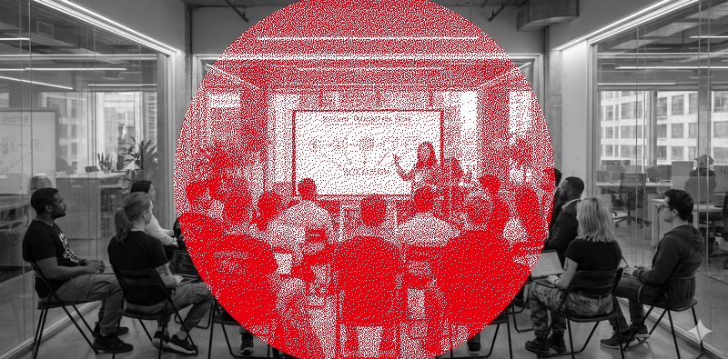
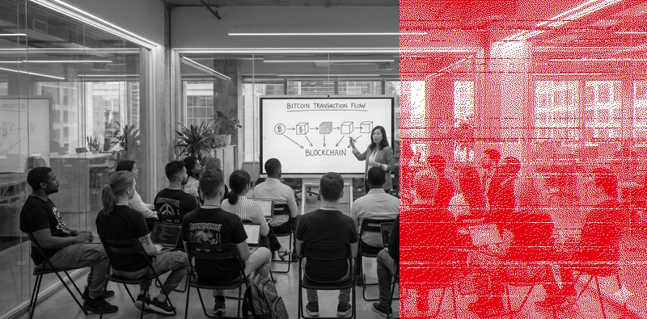
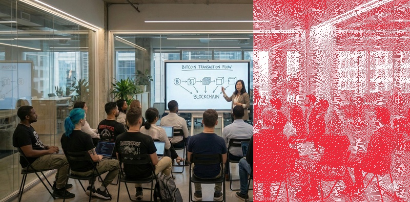
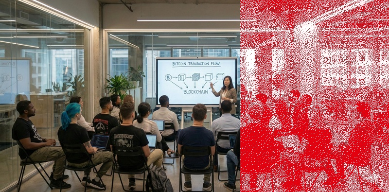
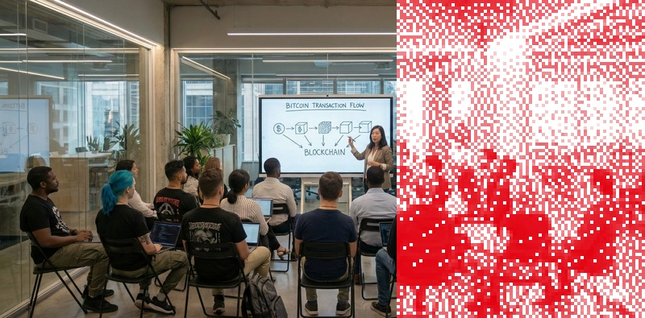
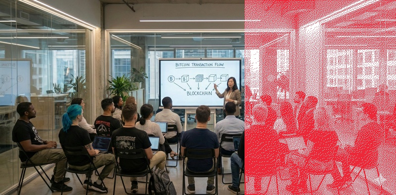

# btcat-img-dither

Image dithering tool that applies monochrome dithering to a portion of an image using Bitcoin Austria brand red (#E3000F).

## Features

- **Multiple dithering regions**: Rectangles, circles, or traditional cut modes
- **Combine shapes**: Mix multiple rectangles and circles in a single image
- **Flexible positioning**: All coordinates accept any float value (not limited to 0-1)
- **Randomized dithering**: Floyd-Steinberg with threshold randomization for organic, less regular patterns
- **Bitcoin Austria brand red**: Uses #E3000F for dithered pixels
- **Background modes**: Choose white (default) or dark (#222222) background for dithered areas
- **Grayscale mode**: Convert entire image to grayscale before applying dithering effects
- **Density control**: Adjust dithering density for sparse or fade effects
- **Format preservation**: Maintains original image format (JPEG/PNG)
- **Smart naming**: Automatic output naming with collision avoidance
- **Zero-configuration**: Ready to run out of the box with UV

## Examples

### Input Image


### Example 1: Basic Grayscale with Cut at 0.67

```bash
./dither.sh --pos=0.67 --grayscale test-image-800px.jpg
```



The entire image is converted to grayscale, then the right 33% is dithered in Austrian flag red (#E3000F).

### Example 2: Multiple Shapes with Grayscale

```bash
./dither.sh --rect=0,0,0.2,1 --rect=0.8,0,1,1 --circle=0.5,0.5,0.2 --jitter=33 --grayscale test-image-800px.jpg
```



Creates two wider vertical strips on the edges (20% width each) plus a circle in the center, all on a grayscale background. The jitter value of 33 adds subtle randomness to the dithering pattern.

### Example 3: Subtle Dithering with Dark Background

```bash
./dither.sh --pos=0.5 --fade=0.4 --background=dark test-image-800px.jpg
```



Dithers the right 50% of the image with 40% pixel density on a dark background (#222222), creating a subtle, translucent effect.

**Note:** Very low fade values (below 0.2) can break the error diffusion algorithm and produce random noise instead of coherent dithering.

### Example 4: High Jitter for Organic Texture

```bash
./dither.sh --circle=0.5,0.5,0.35 --jitter=100 --grayscale test-image-800px.jpg
```



High jitter (100) creates more randomness and organic texture. The default jitter is 30, and `--no-randomize` disables it completely for classic Floyd-Steinberg dithering.

### Example 5: Satoshi Mode

```bash
./dither.sh --circle=0.5,0.5,0.3 --satoshi-mode test-image-800px.jpg
```

“The network self-adjusts.”

Dynamic thresholding adapts to local brightness, preserving more detail in bright and dark areas.

### Example 6: Glitch Mode

```bash
./dither.sh --glitch=0.1 --grayscale test-image-800px.jpg
```



"Corrupt the Dither."

Introduces controlled data degradation for cyberpunk aesthetics:
- Swaps random rows
- Shifts color channels (RGB offset)
- Repeats error diffusion passes with feedback noise

### Fine-tuning Options

| Option | Description | Example Output |
|--------|-------------|----------------|
| **Default** | Standard settings |  |
| **High Jitter** | `... --jitter 100` <br> Increases randomness/noise |  |
| **Scaled Dots** | `... --reference-width 200` <br> Makes dots larger (proportional to width) |  |
| **Darker** | `... --darkness 50` <br> Draws fewer background pixels (darker appearance) |  |


## Installation

This project uses UV for dependency management. If you don't have UV installed:

```bash
curl -LsSf https://astral.sh/uv/install.sh | sh
```

Then install dependencies:

```bash
uv sync
```

## Usage

### Basic Usage

```bash
# Default: vertical cut at golden ratio (~38%/~62%)
./dither.sh image.jpg

# Works with PNG too
./dither.sh image.png
```

### Dithering Modes

#### Rectangle Mode

Define rectangular regions for dithering. Coordinates are specified as `x1,y1,x2,y2` where `(x1,y1)` is the top-left corner and `(x2,y2)` is the bottom-right corner.

```bash
# Single rectangle: dither the right half
./dither.sh --rect=0.5,0,1,1 image.jpg

# Two vertical strips on the edges
./dither.sh --rect=0,0,0.1,1 --rect=0.9,0,1,1 image.jpg

# Top and bottom strips
./dither.sh --rect=0,0,1,0.1 --rect=0,0.9,1,1 image.jpg
```

#### Circle Mode

Define circular regions for dithering. Coordinates are specified as `x,y,radius` where `(x,y)` is the center.

```bash
# Circle in the center
./dither.sh --circle=0.5,0.5,0.3 image.jpg

# Multiple circles
./dither.sh --circle=0.25,0.25,0.15 --circle=0.75,0.75,0.15 image.jpg
```

#### Mix Rectangles and Circles

```bash
# Top strip plus center circle
./dither.sh --rect=0,0,1,0.1 --circle=0.5,0.5,0.2 image.jpg

# Frame effect: strips on all edges plus center circle
./dither.sh --rect=0,0,0.05,1 --rect=0.95,0,1,1 --rect=0,0,1,0.05 --rect=0,0.95,1,1 --circle=0.5,0.5,0.25 image.jpg
```

#### Traditional Cut Mode

```bash
# Vertical cut (default): left part original, right part dithered
./dither.sh --cut=vertical image.jpg

# Horizontal cut: top part original, bottom part dithered
./dither.sh --cut=horizontal image.jpg

# Custom position (0.0 to 1.0)
# For vertical: --pos=0.4 means left 40% original, right 60% dithered
./dither.sh --cut=vertical --pos=0.4 image.jpg

# For horizontal: --pos=0.4 means top 40% original, bottom 60% dithered
./dither.sh --cut=horizontal --pos=0.4 image.jpg
```

### Global Options

#### Grayscale

Converts the **entire image** to grayscale before applying dithering effects.

```bash
# Grayscale entire image, then dither
./dither.sh --grayscale image.jpg

# Combine with shapes
./dither.sh --grayscale --circle=0.5,0.5,0.3 image.jpg
```

#### Fade/Density Control

Control the density of dithering across all dithered areas.

```bash
# Sparse dithering: only 10% of pixels dithered
./dither.sh --fade=0.1 image.jpg

# 50% density for subtle effect
./dither.sh --fade=0.5 --rect=0.5,0,1,1 image.jpg

# Combine with grayscale
./dither.sh --grayscale --fade=0.3 --circle=0.5,0.5,0.4 image.jpg
```

#### Background Color

Choose between white or dark background for dithered areas.

```bash
# White background (default): red dots on white
./dither.sh --background=white image.jpg

# Dark background: red dots on dark gray (#222222)
./dither.sh --background=dark image.jpg

# Combine with fade for subtle dark effect
./dither.sh --background=dark --fade=0.4 --pos=0.5 image.jpg
```

#### Dithering Threshold

```bash
# Adjust the dithering threshold (0-255, default: 128)
# Lower values = more red pixels, Higher values = more white pixels
./dither.sh --threshold 100 image.jpg
```

#### Randomization & Jitter

```bash
# Randomization is enabled by default. Control the amount with --jitter (default: 30.0)
./dither.sh --jitter 50 image.jpg

# Disable randomization for classic Floyd-Steinberg
./dither.sh --no-randomize image.jpg
```

#### Point Size Scaling

Make the dither pattern proportional to the image width.

```bash
# Set a reference width (default: 1024).
# If input is wider than this, dither points become larger.
./dither.sh --reference-width 800 image.jpg
```

#### Darkness Control

Adjust the darkness of the dithered output.

```bash
# Make the result darker (fewer white pixels)
./dither.sh --darkness 30 image.jpg

# Make the result lighter (more white pixels)
./dither.sh --darkness -30 image.jpg
```

#### Satoshi Mode

Enable dynamic thresholding that adapts per pixel based on local brightness.

```bash
# Brighter areas get higher threshold -> fewer red pixels
./dither.sh --satoshi-mode image.jpg
```

#### Glitch Mode

Introduce controlled digital corruption.

```bash
# Mild glitch (0.1): Subtle artifacts, slight color shift
./dither.sh --glitch=0.1 image.jpg

# Heavy glitch (0.5+): Strong channel shifting, row swapping, and noise
./dither.sh --glitch=0.5 image.jpg
```

### Advanced Combinations

```bash
# Grayscale + sparse dithering + custom shapes
./dither.sh --grayscale --fade=0.2 --rect=0,0,0.2,1 --circle=0.6,0.5,0.3 image.jpg

# High jitter + darkness + circle
./dither.sh --jitter=100 --darkness=50 --circle=0.5,0.5,0.4 image.jpg

# Multiple rectangles with threshold adjustment
./dither.sh --threshold=100 --rect=0,0,0.3,1 --rect=0.7,0,1,1 image.jpg
```

## Output

The tool generates output files with the format:
- `[original-name]-dither.[ext]`
- If the file exists, it appends a number: `[original-name]-dither-1.[ext]`

## How It Works

1. **Load and prepare**: Reads the input image and converts to RGB if needed
2. **Grayscale conversion** (optional): If `--grayscale` is specified, converts the entire image to grayscale
3. **Create dithering masks**: Generates boolean masks for rectangles and circles (combined with logical OR)
4. **Dithering**: Applies Floyd-Steinberg error diffusion dithering with optional randomization
5. **Density control** (optional): If `--fade` is specified, probabilistically skips pixels for sparse effects
6. **Colorization**: Renders dithered pixels in Bitcoin Austria red (#E3000F) on chosen background (white or dark #222222)
7. **Compositing**: Applies dithered regions to the base image using the masks
8. **Save**: Outputs the result in the same format as the input with smart naming

## Requirements

- Python 3.10+
- Pillow (for image processing)
- NumPy (for array operations)
- Click (for CLI with automatic validation)

All dependencies are managed automatically by UV.

## License

Apache License 2.0

Copyright 2026 Harald Schilly <hsy@bitcoin-austria.at>

Licensed under the Apache License, Version 2.0. See the [LICENSE](LICENSE) file for details.
